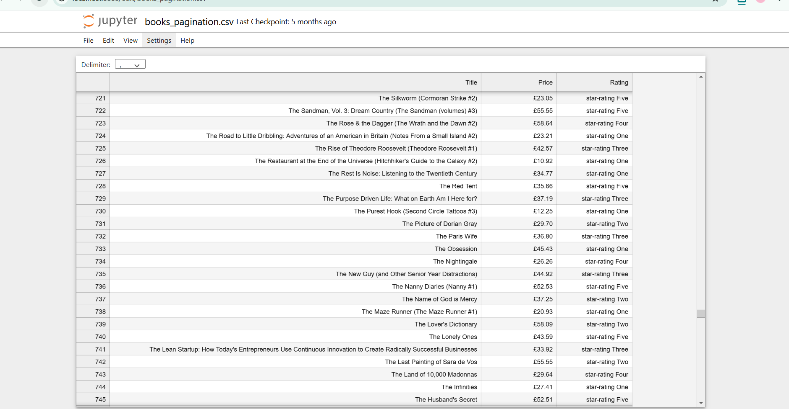

# pagination-scraper

A Python web scraping project that extracts data from multiple pages using pagination.

## Features

- Automatically navigates through multiple pages
- Extracts data from every page
- Saves data into CSV
- Uses BeautifulSoup and Requests

## Technologies Used

- Python
- Requests
- BeautifulSoup
- Pandas

## Output

books_pagination.csv

## Screenshot

## How to Run

pip install requests beautifulsoup4 pandas

python pagination_scraper.py
